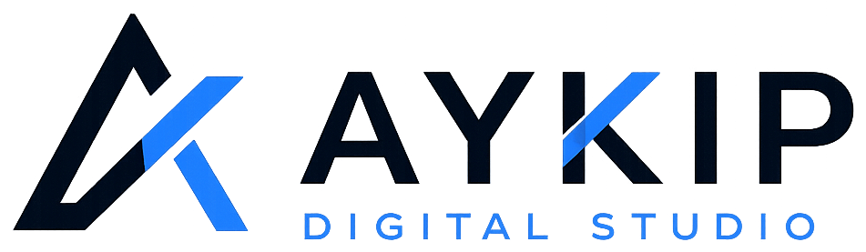

# AYKIP Digital Studio

**Le digital, pensé pour votre activité.**

---

## 🚀 Ce que nous faisons

AYKIP Digital Studio conçoit et développe :

- **Sites web premium** — identité visuelle sur mesure, direction artistique soignée
- **Applications et solutions digitales sur mesure** — pensées pour un besoin réel, pas un template
- **Automatisations et intégrations digitales** — pour simplifier des processus concrets

---

## ✨ Nos projets

**[AYKIP.fr](https://aykip.fr)** — le site vitrine officiel d'AYKIP Digital Studio : présentation de l'agence, des services et des réalisations.

**MaisonHub** — projet indépendant : un dashboard intelligent pour la maison (interface web, iPhone, iPad), développé de bout en bout, du frontend au backend, avec ses intégrations domotiques.
→ [Étude de cas](https://aykip.fr/realisations/maisonhub/)

---

## 🛠️ Technologies

- Astro
- TypeScript
- HTML/CSS moderne
- Cloudflare Workers
- GitHub Actions
- Technologies web modernes

---

## 📬 Contact

- 🌐 Site : [aykip.fr](https://aykip.fr)
- ✉️ Email : [contact@aykip.fr](mailto:contact@aykip.fr)
- 💼 LinkedIn : [AYKIP Digital Studio](https://www.linkedin.com/company/aykip-digital-studio)
